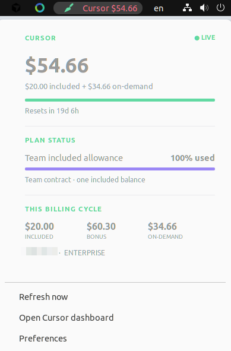

# Cursor Usage Supervisor

A native GNOME Shell 42 top-panel monitor for the Cursor Desktop account that
is already signed in on this computer.



The panel headline shows included usage consumed plus on-demand usage as one
money amount. The popover also shows the verified included allowance,
provider-granted bonus usage, the billing-cycle reset time, and the components
of the headline. It supports usage-based responses and legacy request-count
plans without inventing separate entitlements from ambiguous API fields.

## Data source

Cursor does not keep authoritative usage counters in its local files. This
project opens Cursor's `state.vscdb` **read-only**, takes the current access
token, and queries the same dashboard endpoints used by the signed-in account:

- `GET https://cursor.com/api/usage-summary` (primary)
- `GET https://cursor.com/api/usage?user=...` (legacy-plan detection)

These endpoints are not a documented public API and may change. Enterprise
admins can instead build an organization-wide integration on Cursor's official
[Admin API](https://cursor.com/docs/account/teams/admin-api); this personal
panel deliberately requires no Admin API key.

The service re-reads the database at every refresh. It never reads the refresh
token, never writes Cursor's database, never logs credentials, and never sends
the access token over D-Bus.

## Install on Ubuntu 22.04 / GNOME 42

Password-free per-user installation (recommended):

```bash
./packaging/install_user.sh
```

Reload GNOME Shell (`Alt+F2`, `r`, Enter on X11), then run
`gnome-extensions enable cursor-usage-supervisor@owen.local` if the installer
could not enable it in the current Shell session.

Or install the Debian package system-wide:

```bash
./packaging/build_deb.sh
sudo apt install ./dist/cursor-usage-supervisor_0.1.1_all.deb
systemctl --user daemon-reload
systemctl --user restart cursor-usage-supervisor.service
gnome-extensions enable cursor-usage-supervisor@owen.local
```

On X11, reload GNOME Shell with `Alt+F2`, `r`, Enter if the new indicator does
not appear. Logging out and in also reloads extensions.

## Diagnostics

Print one credential-free snapshot:

```bash
cursor-usage-supervisor-service --once
```

Check the installed D-Bus path:

```bash
gdbus call --session \
  --dest io.github.owen.CursorUsageSupervisor \
  --object-path /io/github/owen/CursorUsageSupervisor \
  --method io.github.owen.CursorUsageSupervisor.Refresh
```

Run tests from the checkout:

```bash
PYTHONPATH=src python3 -m unittest discover -s tests -v
node --check extension/extension.js
```

See [architecture and data-contract details](docs/ARCHITECTURE.md).
