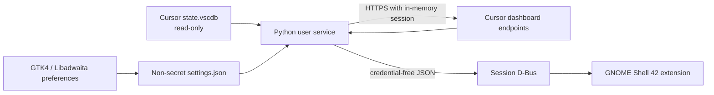

# Architecture and verified data contract

## Why the backend is separate from GNOME Shell

GNOME Shell extensions execute inside the desktop shell. SQLite and HTTPS work
there would risk stalling or crashing the desktop. The extension therefore only
renders a small JSON snapshot obtained asynchronously over the session D-Bus.

The service is D-Bus activated as `io.github.owen.CursorUsageSupervisor` at
`/io/github/owen/CursorUsageSupervisor`. It exposes `GetSummary`, `Refresh`, and
the `UsageChanged` signal.

## Verification approach

Billing-model detection is based on response fields rather than a membership
label:

- both legacy endpoints returned HTTP 200 with `maxRequestUsage: null`;
- `/api/usage-summary` returned the current `individualUsage.plan` shape;
- the independent `DashboardService/GetCurrentPeriodUsage` response can be used
  to cross-check billing-cycle timestamps, included limit, and bonus usage.

Monetary values are returned in cents and retained as integer `*_cents` fields
until the UI formats them.

## Normalized contract

Current plans use `billing_model: usage_based`, with:

- `plan.used_cents`, `limit_cents`, and `remaining_cents`;
- `plan.breakdown.{included,bonus,total}_cents`;
- `plan.total_percent`, plus raw historical Auto/API attribution percentages;
- optional `on_demand` values and the monthly `billing_cycle`.

The panel headline uses `billable_usage_cents = plan.used_cents +
on_demand.used_cents`. Provider-granted `bonus_cents` remains visible but is
excluded from this total because it is free usage, not an on-demand charge.

### Older Team contract caveat

Some older Team contracts expose one included allowance while still returning
historical `autoPercentUsed` and `apiPercentUsed` fields. These fields are not
sufficient evidence of two independently spendable pool entitlements.
Therefore the monitor renders a single verified allowance unless the upstream
contract provides distinct limits.

Legacy plans are selected only when `gpt-4.maxRequestUsage` is a positive
number, and use `billing_model: legacy_request_count`. Missing or unfamiliar
fields produce an explicit unknown/error state; they are never displayed as
zero usage.

## Failure behavior

- An expired login asks the user to sign in again in Cursor Desktop.
- Network/schema errors never include response bodies or credentials.
- After a successful fetch, transient failures retain the last good snapshot
  and visibly mark it `STALE`.
- Automatic polling defaults to five minutes. Manual refresh is available.

## Supported API boundary

Cursor documents usage visibility in the dashboard and documents its Admin API
for enterprise integrations, but not the two personal dashboard endpoints used
here. This personal-session adapter is therefore isolated in `client.py` so it
can be replaced without changing the D-Bus or UI contracts.
